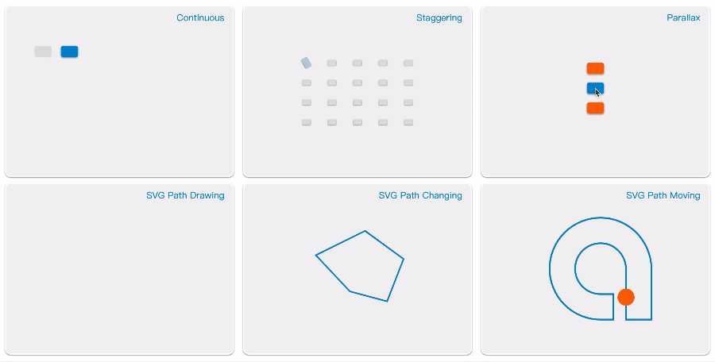

<ClientOnly>
  <Totalizer/>
</ClientOnly>

::: danger
The current version is in beta, and the official version is about to be released.
:::

Totalizer JS provides a simple DOM & SVG animation description, and a mechanism for managing multiple animation descriptions. It was originally designed to create a core animation abstraction layer for building complex animation interaction components.




## Installation

``` shell
npm i -S totalizer
```

## Usage

Import totalizer

``` javascript
import Totalizer from 'totalizer';
```

Create a Totalizer instance

``` javascript
conat animation = new Totalizer();
```

Add an animation description

``` javascript
animation.add({
  el: document.getElementById("div"),   // the target node
  props: {
    translateX: [0, 300],               // translateX from '0px' to '300px'
    scale: [0.4, 1],                    // scale from 0.4 to 1 
    rotate: [0, 720],                   // rotate from 0deg to 720deg
    background: ["#ddd", "#08c"],       // background from '#ddd' to '#08c' 
  },
  delay: 300,                           // delay
  endDelay: 300,                        // endDelay
  duration: 2000,                       // duration
  easing: 'easeOutBounce',              // easing
})
```

Control the animation instance

``` javascript
animation.loop().alternate().play();
```

