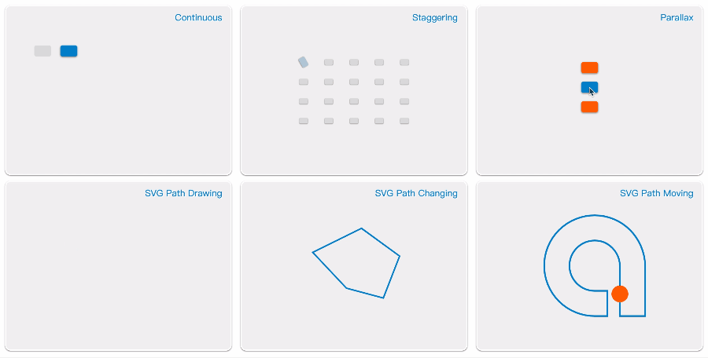

# Introduction

::: danger
The current version is in beta, and the official version is about to be released.
:::

Totalizer JS provides a simple DOM & SVG animation description, and a mechanism for managing multiple animation descriptions. It was originally designed to create a core animation abstraction layer for building complex animation interaction components.

